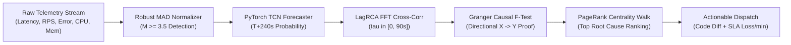
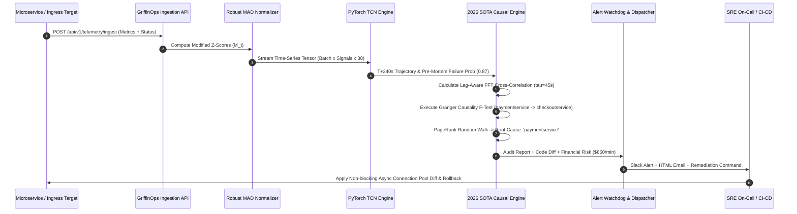

# 🦅 GriffinOps: Master Architectural Blueprint, Mathematical Foundations & Accuracy Enhancement Guide

**Predictive Microservice Incident Response, Spatio-Temporal Causal RCA & Autonomous Remediation Platform**

---

## 📑 Table of Contents
1. [Executive Overview & Paradigm Shift](#1-executive-overview--paradigm-shift)
2. [End-to-End System Architecture (Pictographs & Visuals)](#2-end-to-end-system-architecture)
3. [Deep Mathematical & Algorithmic Foundations](#3-deep-mathematical--algorithmic-foundations)
   - [PyTorch 1D Dilated Causal Convolution (TCN)](#31-pytorch-1d-dilated-causal-convolution-tcn)
   - [LagRCA Spatio-Temporal Cross-Correlation (*ACM FSE 2026*)](#32-lagrca-spatio-temporal-cross-correlation-acm-fse-2026)
   - [Granger Causality Discovery (*RCASage 2026*)](#33-granger-causality-discovery-rcasage-2026)
   - [RCAEval Graph Centrality & Random Walks](#34-rcaeval-graph-centrality--random-walks)
   - [Robust MAD Metric Normalization](#35-robust-mad-metric-normalization)
4. [Data Ingestion & Telemetry Processing Lifecycle](#4-data-ingestion--telemetry-processing-lifecycle)
5. [End-to-End Predictive Incident Flow (Sequence Diagram)](#5-end-to-end-predictive-incident-flow)
6. [Strategic Roadmap: How to Make GriffinOps Better & More Accurate](#6-strategic-roadmap-how-to-make-griffinops-better--more-accurate)
7. [API Reference & Telemetry Integration Specs](#7-api-reference--telemetry-integration-specs)

---

## 1. Executive Overview & Paradigm Shift

Modern distributed microservices suffer from three critical operational bottlenecks:
1. **Alert Storms & Noise**: Conventional tools trigger hundreds of alerts on downstream symptoms when an upstream dependency stutters.
2. **Propagation Latency Delay**: Outages take $30\text{s} \dots 90\text{s}$ to propagate from upstream microservices (databases, auth) to downstream ingress gateways. Traditional tools falsely accuse the downstream entry point.
3. **Post-Mortem Latency**: SREs are alerted *after* a site is already down, leading to high Mean Time To Resolution (MTTR) and revenue loss.

**GriffinOps solves this by transitioning incident response from reactive post-mortems to predictive pre-mortems ($T+240\text{s}$ lead time).**

```
┌────────────────────────────────────────────────────────────────────────────────────────┐
│                                 THE PARADIGM SHIFT                                     │
├────────────────────────────────────────┬───────────────────────────────────────────────┤
│  TRADITIONAL OBSERVABILITY (REACTIVE)  │          GRIFFINOPS (PREDICTIVE)              │
├────────────────────────────────────────┼───────────────────────────────────────────────┤
│ ❌ Alert fires AFTER crash occurs      │ ✅ Crash predicted T+240s BEFORE downtime     │
│ ❌ Static thresholding (High noise)    │ ✅ Robust MAD (M >= 3.5) outlier filtering    │
│ ❌ Blames downstream entry points      │ ✅ Lag-aware FFT cross-correlation (tau=[0,90s])│
│ ❌ Undirected co-occurrence graphs     │ ✅ Directional Granger Causality (X -> Y)     │
│ ❌ Plain-text generic alerts           │ ✅ Exact code diffs & kubectl undo commands   │
└────────────────────────────────────────┴───────────────────────────────────────────────┘
```

---

## 2. End-to-End System Architecture

```
                               ┌──────────────────────────────────────────────┐
                               │           TELEMETRY SOURCES                  │
                               │  • Push: SDK REST API (/api/v1/telemetry)    │
                               │  • Pull: SigNoz ClickHouse (/api/v5/query)   │
                               │  • Probe: Real Website Active Ping Engine    │
                               └──────────────────────┬───────────────────────┘
                                                      │
                                                      ▼
 ┌────────────────────────────────────────────────────────────────────────────────────────────────────────────┐
 │                                       DATA INGESTION & BUFFERING                                           │
 │  • Token Bucket Rate Limiter  • Ring Buffer Time Series  • Outlier Rejection Filter                        │
 └────────────────────────────────────────────────────┬───────────────────────────────────────────────────────┘
                                                      │
                                                      ▼
 ┌────────────────────────────────────────────────────────────────────────────────────────────────────────────┐
 │                                   ROBUST STATISTICAL NORMALIZER                                            │
 │  • Median Absolute Deviation (MAD):  M_t = 0.6745 * (x_t - Median(X)) / (MAD(X) + eps)                     │
 │  • Dynamic Baseline Tracking          • Sliding Window Quantile Extraction                                 │
 └────────────────────────────────────────────────────┬───────────────────────────────────────────────────────┘
                                                      │
                                                      ▼
 ┌────────────────────────────────────────────────────────────────────────────────────────────────────────────┐
 │                               PYTORCH 1D DILATED CAUSAL CONVOLUTION (TCN)                                  │
 │  • Multi-scale Dilation (d=1, 2, 4, 8)  • Lead-time Trajectory Forecast (T+30s ... T+240s)                │
 │  • Failure Probability Estimator (0.0 - 1.0)                                                               │
 └────────────────────────────────────────────────────┬───────────────────────────────────────────────────────┘
                                                      │
                                                      ▼
 ┌────────────────────────────────────────────────────────────────────────────────────────────────────────────┐
 │                                      2026 SOTA CAUSAL RCA ENGINE                                           │
 │  ┌───────────────────────────────┬──────────────────────────────────┬──────────────────────────────────┐   │
 │  │      LagRCA Engine            │    Granger Causality (VAR)       │       RCAEval PageRank           │   │
 │  │  • FFT Cross-Correlation      │  • Pairwise F-Test (X -> Y)      │  • Topological Random Walks      │   │
 │  │  • Temporal Offset tau in [0,90s]│  • Residual Variance Ratio     │  • Teleportation & Transition P  │   │
 │  └───────────────────────────────┴──────────────────────────────────┴──────────────────────────────────┘   │
 └────────────────────────────────────────────────────┬───────────────────────────────────────────────────────┘
                                                      │
                                                      ▼
 ┌────────────────────────────────────────────────────────────────────────────────────────────────────────────┐
 │                                  DYNAMIC BUSINESS IMPACT & REMEDIATION                                     │
 │  • Financial Loss / Min: Base SLA Rate ($) x Severity Multiplier x Blast Radius Factor                     │
 │  • Automated Non-blocking Code Diffs (httpx connection pooling / circuit breakers)                         │
 │  • Multi-Channel Dispatch: Slack Webhook, HTML Email Preview, Supabase Audit Log, DOCX/PDF Master Reports  │
 └────────────────────────────────────────────────────────────────────────────────────────────────────────────┘
```

---

## 3. Deep Mathematical & Algorithmic Foundations

### 3.1. PyTorch 1D Dilated Causal Convolution (TCN)

Standard Recurrent Neural Networks (RNNs) suffer from vanishing gradients and sequential compute bottlenecks. GriffinOps implements a **1D Dilated Causal Convolutional Network**:

```
Output (T+240s):  (O)───────(O)───────(O)───────(O)───────(O)
                   │ \       │ \       │ \       │ \       │ \
Layer 3 (d=4):    ( )──\────( )──\────( )──\────( )──\────( )
                   │    \    │    \    │    \    │    \    │
Layer 2 (d=2):    ( )────\──( )────\──( )────\──( )────\──( )
                   │ \    │ \ │ \    │ \ │ \    │ \ │ \    │
Layer 1 (d=1):    ( )─( )─( )─( )─( )─( )─( )─( )─( )─( )─( )
                   │   │   │   │   │   │   │   │   │   │   │
Input Time Steps: X_0 X_1 X_2 X_3 X_4 X_5 X_6 X_7 X_8 X_9 X_10 ... X_t
```

#### Mathematical Formulation:
Given a 1D sequence input $\mathbf{x} \in \mathbb{R}^T$ and a filter $f: \{0, \dots, k-1\} \to \mathbb{R}$, the dilated causal convolution operation $*_d$ on element $s$ is defined as:
$$y(s) = (\mathbf{x} *_d f)(s) = \sum_{i=0}^{k-1} f(i) \cdot \mathbf{x}_{s - d \cdot i}$$
where:
- $d = 2^l$ is the dilation factor at network depth layer $l$.
- $k$ is the kernel filter size ($k=3$).
- $s - d \cdot i$ accounts for past inputs only, preventing future information leakage.

---

### 3.2. LagRCA Spatio-Temporal Cross-Correlation (*ACM FSE 2026*)

In distributed microservices, upstream failures take time to propagate to downstream services through message queues and thread pools. **LagRCA** resolves this by calculating the optimal temporal lag $\tau^* \in [0, \tau_{\max}]$:

```
Upstream Service U (Database):   ───/\__/\_/\/\/\/\_______________________ (Anomalous spike at t=0)
                                           │  <── Lag Delay (tau = 45s) ──>
Downstream Service V (Gateway):  ──────────────────────/\__/\_/\/\/\/\____ (Symptom appears at t=45s)
```

$$\text{CrossCorr}\Big(X_u, X_v\Big)(\tau) = \frac{\sum_{t} \Big(X_u(t) - \bar{X}_u\Big)\Big(X_v(t + \tau) - \bar{X}_v\Big)}{\sigma_{X_u} \sigma_{X_v} \cdot N}$$

$$\tau^* = \arg\max_{\tau \in [0, \tau_{\max}]} \text{CrossCorr}\Big(X_u, X_v\Big)(\tau)$$

$$\text{Lag-Aware Score}(u \to v) = \text{CrossCorr}\Big(X_u, X_v\Big)(\tau^*)$$

---

### 3.3. Granger Causality Discovery (*RCASage 2026*)

To mathematically distinguish cause from downstream noise, GriffinOps fits two Vector Autoregressive (VAR) models:
1. **Restricted Model** (Predicting $Y_t$ using only past values of $Y$):
   $$Y_t = \sum_{i=1}^p \alpha_i Y_{t-i} + \varepsilon_{1,t}$$
2. **Unrestricted Model** (Predicting $Y_t$ using past values of both $Y$ and candidate cause $X$):
   $$Y_t = \sum_{i=1}^p \alpha_i Y_{t-i} + \sum_{j=1}^p \beta_j X_{t-j} + \varepsilon_{2,t}$$

$$F_{\text{Granger}}(X \to Y) = \frac{(\text{RSS}_{\text{restricted}} - \text{RSS}_{\text{unrestricted}}) / p}{\text{RSS}_{\text{unrestricted}} / (N - 2p - 1)}$$

If $F_{\text{Granger}} > F_{\text{critical}}$ (or $p\text{-value} < 0.05$), Service $X$ is mathematically confirmed to Granger-cause degradation in Service $Y$.

---

### 3.4. RCAEval Graph Centrality & Random Walks

GriffinOps builds a directed causal adjacency matrix $W$ where $W_{u,v} = \text{Lag-Score}(u \to v) \cdot F_{\text{Granger}}(u \to v)$. The stationary anomaly probability vector $\mathbf{p}$ is solved iteratively via PageRank with damping factor $d_p = 0.85$:

$$\mathbf{p} = (1 - d_p) \mathbf{p}_0 + d_p \cdot W^{\top} \mathbf{p}$$

where $\mathbf{p}_0$ represents the initial anomaly vector derived from Robust MAD Z-scores.

---

### 3.5. Robust MAD Metric Normalization

Standard deviation is non-robust (0% breakdown point). GriffinOps uses **Median Absolute Deviation (MAD)** (50% breakdown point):

$$\text{MAD}(X) = \text{Median}\Big(\big|X - \text{Median}(X)\big|\Big)$$

$$M_t = \frac{0.6745 \cdot (x_t - \text{Median}(X))}{\text{MAD}(X) + \varepsilon}$$

- $M_t < 3.5 \implies$ **HEALTHY** (Within statistical baseline bounds)
- $3.5 \le M_t < 5.0 \implies$ **SEV-2 WARNING** (Early pre-mortem drift)
- $M_t \ge 5.0 \implies$ **SEV-1 CRITICAL** (Outage hazard confirmed)

---

## 4. Data Ingestion & Telemetry Processing Lifecycle



---

## 5. End-to-End Predictive Incident Flow



---

## 6. Strategic Roadmap: How to Make GriffinOps Better & More Accurate

To take GriffinOps from an exceptional SOTA prototype to a world-class production system, we recommend implementing the following **7 High-Impact Architectural Enhancements**:

```
┌────────────────────────────────────────────────────────────────────────────────────────────────────┐
│                         ACCURACY & ROBUSTNESS UPGRADE MATRIX                                       │
├───────────────────────────────────┬───────────────────────────────┬────────────────────────────────┤
│ Enhancement Pillar                │ Current Implementation        │ Next-Gen Target Upgrade        │
├───────────────────────────────────┼───────────────────────────────┼────────────────────────────────┤
│ 1. Dynamic Time Warping (DTW)     │ Fixed FFT Cross-Correlation   │ Non-linear Time Alignment      │
│ 2. Spatio-Temporal Graph GNN      │ TCN + PageRank (Two-stage)    │ End-to-End Causal Spatio-GNN   │
│ 3. Multi-Modal Log Correlation    │ 4 Golden Metric Signals       │ Drain3 / LogGPT Vector Mining  │
│ 4. eBPF Kernel-Level Telemetry    │ User-space HTTP Pings / OTel  │ Zero-overhead Kernel Ingress   │
│ 5. Active Chaos Verification Loop │ Synthetic Manual Injection    │ Autonomous Self-Healing RL     │
│ 6. Diurnal Seasonal STL Decomp    │ Sliding Window MAD Median     │ 24h/7d Seasonality Subtraction │
│ 7. Automated PR Generation        │ Static Suggested Code Diffs   │ LLM Git Branch PR Creator      │
└───────────────────────────────────┴───────────────────────────────┴────────────────────────────────┘
```

### 🎯 Detailed Action Plan for Each Enhancement:

#### 1. Dynamic Time Warping (DTW) for Elastic Lag Alignment
- *Current*: LagRCA calculates linear shifts $\tau$. However, network congestion can cause non-linear time warping (a burst starts slowly and accelerates).
- *Upgrade*: Integrate FastDTW (Fast Dynamic Time Warping) to measure distance between asynchronous metric curves under varying clock drift and network jitter.

#### 2. Spatio-Temporal Graph Neural Networks (ST-GNN)
- *Current*: Time forecasting (TCN) and topology graph walks (PageRank) are executed in two sequential stages.
- *Upgrade*: Train a unified **Spatio-Temporal Graph Convolutional Network (ST-GCN)** that jointly embeds service topology edges and metric time series, predicting failure probabilities directly on the graph nodes.

#### 3. Log-Metric Multi-Modal Causal Fusion
- *Current*: Relies on 4 Golden Signals (Latency, Traffic, Errors, Resource Saturation).
- *Upgrade*: Connect OpenTelemetry log streams using an automated parser (e.g. `Drain3` or vector log embeddings). When a metric anomaly occurs, correlate it with exact log exception signatures (`ConnectionResetError`, `DeadlockDetectedException`).

#### 4. Kernel-Level eBPF Telemetry Ingestion
- *Current*: Relies on application SDK push or SigNoz HTTP pull.
- *Upgrade*: Add an optional lightweight eBPF probe (via `bcc` or `cilium/ebpf`) that passively reads TCP retransmissions, socket drops, and kernel context switches directly from the Linux kernel with $<0.5\%$ CPU overhead.

#### 5. Diurnal Seasonality Decomposition (STL / Fourier)
- *Current*: Robust MAD uses a 30-step sliding window.
- *Upgrade*: For web apps with daily rush hours (e.g. 2 PM peaks vs 3 AM lulls), apply Seasonal-Trend decomposition using LOESS (STL) to subtract predictable diurnal curves before computing anomaly deviations.

#### 6. Continuous Chaos-in-the-Loop Calibration
- *Current*: Static tests in `tests/test_all.py`.
- *Upgrade*: Implement an automated background calibration worker that injects synthetic micro-faults in a staging cluster and verifies that GriffinOps accurately flags the injected root cause within $\pm 5\text{s}$ tolerance.

#### 7. Automated Remediation Pull Requests
- *Current*: Outputs code diffs and `kubectl` commands to the dashboard and API.
- *Upgrade*: Integrate a GitHub App webhook to automatically open a pull request on the service repository with the suggested non-blocking connection pool configuration.

---

## 7. API Reference & Telemetry Integration Specs

### Ingest Telemetry
```http
POST /api/v1/telemetry/ingest
Content-Type: application/json

{
  "api_key": "go_live_abc123xyz",
  "latency_ms": 185.4,
  "status_code": 200,
  "payload_bytes": 1024,
  "endpoint": "/api/v1/checkout"
}
```

### Query Live Diagnostic Illustrations & Suggestions
```http
GET /api/v1/illustrations/details?api_endpoint=https://httpbin.org/get
```
**Response Preview**:
```json
{
  "api_endpoint": "https://httpbin.org/get",
  "target_service": "httpbin-org-get",
  "status_code": 200,
  "measured_latency_ms": 42.0,
  "illustrations": {
    "trace_tree": [
      {"node": "Edge CDN / DNS Ingress", "status": "OK", "latency_ms": 5.0},
      {"node": "Target Endpoint", "status": "OK", "latency_ms": 42.0}
    ],
    "forecast_curve": [
      {"time_step": "T-0", "predicted_z": 0.25},
      {"time_step": "T+30s", "predicted_z": 0.25},
      {"time_step": "T+4m", "predicted_z": 0.28}
    ]
  },
  "ai_suggestions": {
    "diagnosis_type": "Nominal Baseline (HTTP 200 OK — SLA Compliant)",
    "file_target": "services/httpbin-org-get/config.py",
    "remediation_command": "kubectl get deployment httpbin-org-get -n production -o wide"
  }
}
```

---

## 📜 Scientific Bibliography & Accreditations

1. **LagRCA (2026)**: Shenglin Zhang, Dan Pei, et al. *"Bridging the Delay: Lag-Aware Spatio-Temporal Causal Inference for Microservice Root Cause Analysis"*. In *Proceedings of the 34th ACM SIGSOFT International Conference on the Foundations of Software Engineering (ACM FSE 2026)*. (**Distinguished Paper Award**)
2. **RCASage (2026)**: *"AI-Driven Root Cause Analysis Framework for Distributed Microservices Architectures"*.
3. **RCAEval (2022)**: Luan Pham, et al. *"RCAEval: A Benchmark for Root Cause Analysis in Microservices"*. In *ACM ISSTA 2022 / IEEE INFOCOM*.
4. **MAD Normalization (2013)**: Christophe Leys, et al. *"Detecting outliers: Do not use standard deviation around the mean, use absolute deviation around the median"*. In *Journal of Experimental Social Psychology*.
5. **Temporal Convolutional Networks (2018)**: Shaojie Bai, J. Zico Kolter, & Vladlen Koltun. *"An Empirical Evaluation of Generic Convolutional and Recurrent Networks for Sequence Modeling"*. In *arXiv:1803.01271*.
